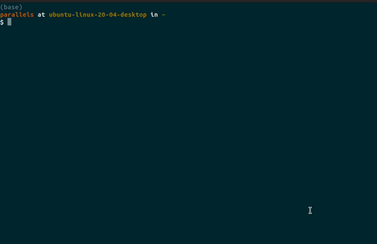

# ette (Encrypted Terminal Text Editor)

[](https://github.com/ryanmcdermott/ette/actions/workflows/main.yml)

ette is an encrypted terminal text editor. It is written in C++ and has no external runtime dependencies.

**USE THIS PROGRAM AT YOUR OWN RISK. IT HAS NOT BEEN AUDITED FOR DATA SECURITY. SEE LICENSE.**

## Demo



## Philosophy

* No external runtime dependencies.
* Small enough codebase to be readable within an afternoon.
* VT100 compatabile.
* AES-256 encryption.
* C++17 or later.
* Buildable and runnable until the end of time, as long as a C++17 compiler exists and a VT100 compatible terminal is available.

## Platforms

Tested on:

* macOS >= 13
* Ubuntu >= 20.04

## Building

```
make
```

## Testing

Requires Bazel.

```
bazel test //...
```

## Usage (encrypted)

1. `./ette <filename>.aes256cbc`
1. Type password
1. Confirm password (if new file).
1. Type text...
1. `CTRL+S` to save. Your file will be encrypted and saved.
1. `CTRL+Q` to exit.


## Usage (unencrypted)

```
./ette <filename>
```

## LICENSE

MIT. See LICENSE file.

## Credits

Adapted from [kilo](https://github.com/antirez/kilo) by Salvatore Sanfilippo. Uses [https://github.com/kkAyataka/plusaes](plusaes) for encryption.